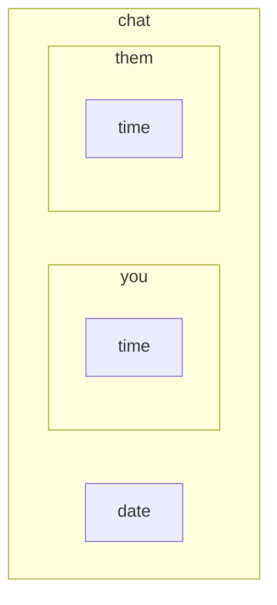

[< Back](README.md)

# Chat Callout

> [!NOTE]
> **Snippet File:** [`callout-chat.css`](callout-chat.css)

Adds a callout type `chat` with which you can display chats.

Each chat bubble is displayed through nested callouts inside the `chat` callout. The chat bubbles use types `them` and `you` to denote who is sending what message.

If you add the metadata `group` to the `chat` callout (`chat|group`), then messages displayed as `them` retain their title.

## Nested Types

| Type      | Description                                                                   |
| --------- | ----------------------------------------------------------------------------- |
| `[!you]`  | Used as the message the sender is sending                                     |
| `[!them]` | Used as the message the recipient is sending                                  |
| `[!time]` | Meant for noting a message's timestamp, only usable in `[!you]` and `[!them]` |
| `[!date]` | Meant for noting a date change in between messages                            |

<details><summary>Visual representation of the hierarchy</summary><p>



</p></details>

## Metadata

> [!TIP]
> Metadata is added to a callout in the square brackets of the type identifier, after the type itself with a pipe (`|`):
> ```md
> > [!type|metadata another-metadata]
> ```

| Metadata | Description                                                |
| -------- | ---------------------------------------------------------- |
| `group`  | Makes recipient's names visible (using the callout titles) |

## Usage

1. Create a callout with the *type identifier* `chat` (optionally add the metadata `group`, `chat|group`)
2. Use [nested callouts](https://help.obsidian.md/callouts#Nested%20callouts) with type identifiers `them` and `you` for the messages
	- Optionally, add another nested callout with type identifier `time` to display sent time
3. Optionally, you can add a nested callout with type identifier `date` to display a change of date between messages

## Example

### Normal

```md
> [!chat] DM
> > [!you]
> > Aliquam erat volutpat. Praesent ac ante.
> > > [!time] 20:45
> 
> > [!date] 2026.02.20
> 
> > [!you]
> > Praesent vulputate euismod ligula. Ut ipsum.
> > > [!time] 09:54
> 
> > [!them]
> > Duis facilisis nulla quis mauris tempus, nec mattis tellus.
> > > [!time] 11:31
```

### Group

```md
> [!chat|group] Group
> > [!date] 2026.02.19
> 
> > [!them] Alice
> > Lorem ipsum dolor sit amet, consectetur adipiscing elit.
> > > [!time] 15:21
> 
> > [!you]
> > Donec congue, tortor vitae interdum.
> > > [!time] 15:24
> 
> > [!them] Bob
> > Sed nec lorem et urna.
> > > [!time] 15:24
> 
> > [!date] 2026.02.20
> 
> > [!you]
> > Praesent felis.
> > > [!time] 10:36
```
