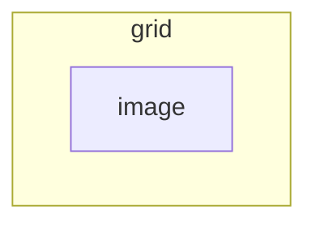

[< Back](README.md)

# Grid Callout

> [!NOTE]
> **Snippet File:** [`callout-grid.css`](/callout-grid.css)

Adds a callout type `grid` with which you can structure content in a grid instead of using tables.

## Nested Type

| Type       | Description                                                 |
| ---------- | ----------------------------------------------------------- |
| `[!image]` | Displays the image(s) inside this callout with a background |

<details><summary>Visual representation of the hierarchy</summary><p>



</p></details>

## Metadata

> [!TIP]
> Metadata is added to a callout in the square brackets of the type identifier, after the type itself with a pipe (`|`):
> ```md
> > [!type|metadata another-metadata]
> ```

| Metadata       | Description                                                                                                                          |
| -------------- | ------------------------------------------------------------------------------------------------------------------------------------ |
| `columns-*`    | Changes the amount of columns, where `*` is any amount between 3 & 5<br>Omitting this metadata will result in a default of 2 columns |
| `align-center` | Centers each cell's content vertically, instead of stretching it                                                                     |

## Usage

1. Set the callout type identifier to `grid`, then add content with a blank line in between to separate it into the different grid cells.
- Optionally add the callout metadata `columns-3`, `colums-4`, or `colums-5` to use 3, 4, or 5 columns respectively, instead of 2 columns.
- Optionally add the callout metadata `align-center` to align the items in the center, instead of stretching them.
- Optionally use the nested callout type `image` for when you want to give an image a background if the height doesn't quite match the contents in the cells in the same row.

This callout pairs well with metadata `hide-title` and `hide-background`.

## Examples

```md
> [!grid|align-center] Cute Cat Pictures
> 
> 
> 
> 
> 
> 
> 
```

```md
> [!grid|columns-3]
> > [!quote|hide-title]
> > Lorem ipsum dolor sit amet, consectetur adipiscing elit. Pellentesque eleifend auctor turpis. Aliquam ac mi elementum, interdum lectus at, tincidunt mauris. Integer sagittis.
> 
> > [!image]
> > 
> 
> > [!danger|hide-title hide-bg]
> > Lorem ipsum dolor sit amet, consectetur adipiscing elit. Pellentesque eleifend auctor turpis. Aliquam ac mi elementum, interdum lectus at, tincidunt mauris. Integer sagittis.
```
